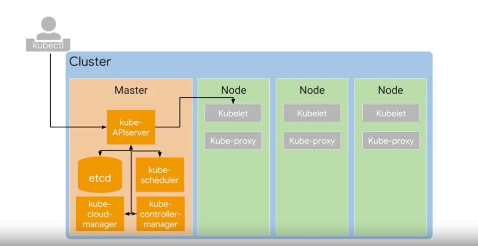
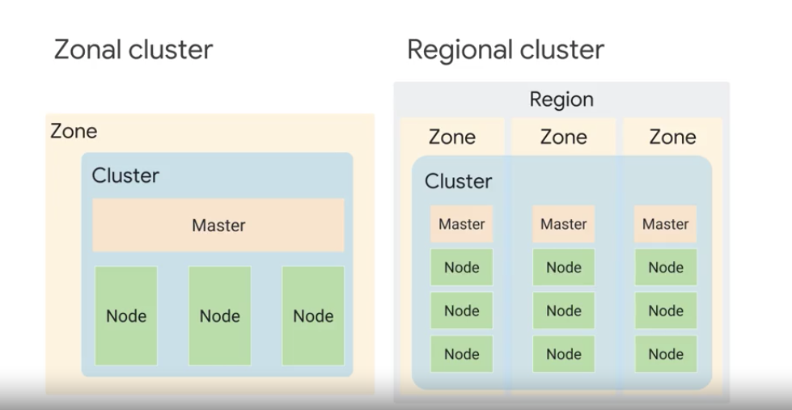

### Kubernetes
- Open Source: vendor neutral cloud native computing foundation
- Automation: `scaling`, `load balancing`, logging, monitoring, and other management fatures of containerized applications (plaform as service)
- Container management: user preferences and configuration flexibility (infrastructure as a service)
- `Declarative configuration`: You describe the state, and Kubernetes will keep it there in spite of failures
- Imperative configuration: Only for quick temporary fixes

### GKE (Google Kubernetes Engine)
> Compute Engine (Iaas) - GKE (Hybrid) - App Engine (PaaS) - Cloud Functions (Serverless logic)
- Deploy, manage, scale Kubernetes environment for containerized application on GCP
- Fully managed
- Container-optimized OS
- Auto upgrade
- Auto repair
- Cluster scaling
- Seamless integration
- Identity and access management
- Integrated logging and monitoring
- Integrated networking
- GCP Console

### Kubernetes Object and Pod
Persistent entities representing the state of the cluster.
- `Object Spec`: Desired state described by us ex) three egix pods always kept running
- `Object Status`: Current status described by kubernetes
#### Pod
> 가장 작은 쿠버네티스 오브젝트가 컨테이너라고 생각하기 쉬운데 그렇지 않고 `POD`이다
- Basic building block
- A pod embodies the environment where the container live
- If there is more than one container in pod, they are tightly coupled and share resources such as `IP address`, `network ports`, and `storage`
> POD안에 컨테이너는 리소스를 공유하기 때문에 localhost 127.0.0.1 로 서로 접근할 수 있고 latency를 최소화 해야하는 어플리케이션은 같은 POD안에 넣어주면 좋다.

Related to: `Declarative configuration`
#### Object Management example
> How to contain 3 NGINX pods?
> Controller: `nginx Pod`, `nginx Pod`, `nginx Pod`
> Controller Object types: `Deployment`, `StatefulSet`, `DaemonSet`, `Job`
- Object definition (Pod)
~~~yaml
apiVersion: app/v1
kind: Pod
metadata:
    name: nginx
    namespace: demo
    labels:
        app: nginx        
spec:
    containers:
    - name: nginx
      image: ngnx:latest
~~~
Applying namespace at the command line level make your YAML files more flexible
~~~
$ kubectl -n demo apply -f mypod.yaml
~~~

- Controller Object definition (Deployment)
> Deployment is to ensure that a defined set of Pods is running at any given time.
~~~yaml
apiVersion: app/v1
kind: Deployment
metadata:
    name: nginx-deployment
    labels:
        app: nginx
spec:
    replicas: 3
    template:
        metadata:
            labels:
                app: nginx
                env: dev
                stack: frontend
        spec:
            containers:
            - name: ngix
              image: nginx:latest
    selector:
        matchLabels
        app: nginx
~~~
~~~
$ kubectl get pods -selector=app=nginx
~~~
> Tip! use version control on YAML files

#### Namespace
- Namespaces let you implement resource quotas across your cluster.
- Namespaces allow you to use object names that would otherwise be duplicates of one another.

### Kubernetes Control Plane
~~~
Cluster = Master + Node
~~~

Master
- coordinate the entire cluster
- Kube API server
> Master의 Kube API서버가 cubectl 명령어를 받아서 요청에 대한 인증을 태움
- etcd: database to store the state of the cluster and cluster configuration data such as what nodes are part of the cluster, what pods should be running, and where should be running
- kube scheduler: scheduling pods onto the nodes obeying constraints that you define on where a pod may run based on hardware, software, and policy. ex) certain pod is only allowed to run on nodes with a certain amount of memory, the same node or anti affinity specifications
> kube scheduler가 어떤 노드에 pod를 배포할지를 결정하는데 사용자가 지정한 스펙에 따른다. 예를 들면 메모리를 충분히 확보해야 하는 pod가 있을 수 있고, 같이 배포해야하는 것들, 같이 배포하면 안 되는 것들은 specificatin에 정의해준다.
- kube controller-manager: It monitors the states of a cluster through kube-APIserver. It make changes to achieve the desired state.
Node
- Kublet: Kubernetes agent on each node. When the Kube-APIserver wants to start a pod on a node, it connects to that node's Kubelet.
- Kube-proxy: Network connectivity among the pods in a cluster

### Zonal vs Regional cluster

- Zonal cluster (default):  
Single GCP compute zone with three identical nodes.  
All in one node pool. 
A single endpoint for the cluster 
- Regional cluster:  
master nodes are spread out across multiple Compute Engine zones within a region 
 
 

## Lab - GCP Console and Cloud Shell
### Compute Engine : VM
- Cost: 2 vCPUs (n1-standard-2) => micro (1 shared vCPU)
> CPU type을 바꿔서 금액 확인해보면 2 CPU 일 때 금액이 두 배
> Preemtability : off
> Firewall : Allow HTTP traffic 을 하면 자동으로 네트워크 태그가 http-server로 들어감
> 수정할 수 있는 부분 : Machine type (must stop VM), add disks, network tags
- `gsutil acl [get|set]`

## Lab - Cloud build
Dockerfile
~~~bash
FROM alpine
COPY quickstart.sh /
CMD ["/quickstart.sh"]
~~~
Cloud Build
~~~bash
$ gcloud builds submit --tag gcr.io/${GOOGLE_CLOUD_PROJECT}/quickstart-image .
~~~

## Discussion
- Kubernetes를 어떤 경우에 사용하면 좋을까?
> Scalibility가 보장되어야 하는 application 인데 on-prem에서 개발하지만, cluster 도 고려하고 있는 경우, 해외 유저를 위한 서비스를 개발하고 있는 경우, 배포 specification이 복잡한 경우
- Kubernetes를 셋업해서 쓸 때와 GKE를 쓸 때와 다른 점이 있다면?
> Kubernetes는 node를 만들어주지 않기 떄문에 클러스터 어드민이 node를 만들고 Kubernetes를 붙여줘야 하지만 GKE는 Compute Engine 인스턴스를 노드로 만들어서 등록해준다.
- `Kubernetes control plain`
- 논쟁이 많았던 아키텍처. API server가 모든 서버의 트래픽을 직접 받는 것일까? 아니면 외부 트래픽은 Node가 직접 받고 API server는 kubectl만 트래픽을 받는 것일까?
- Regional cluster로 설정하면 같은 resion내 다른 zone에 셋업하는 것인가? 아니면 다른 region에 셋업하는 것인가?
- Kubernetes 설정이 궁금하다. `Declarative configuration` 이란?
- Stateful과 Stateless를 둘 다 지원하는 것에 대해 강좌에서 강조한 이유는 무엇일까?
- Pod 안에 여러 컨테이너를 두면서 networking storage를 공유하는 케이스에 대해
- Kube scheduler가 pod를 어디에 실행할지 어떻게 아는 것일까? 
> It knows the state of all the nodes, and it will also obey constraints that you define on where a pod ay run based on hardware, software, and policy
- Object description하는 부분에 pod와 deployment가 겹치는 부분이 있는 것 같은데?
- IAM service account: Project > Editor
> Json key file 사용 용도?