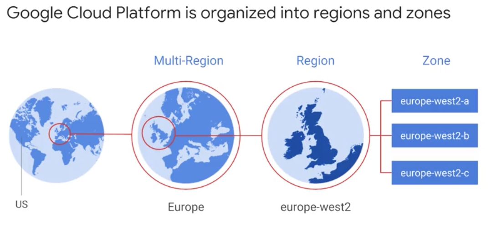
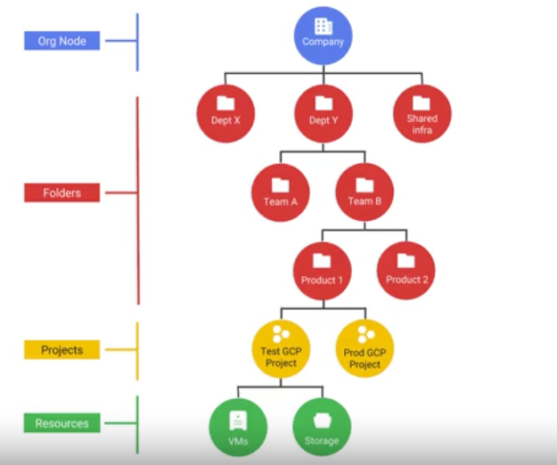
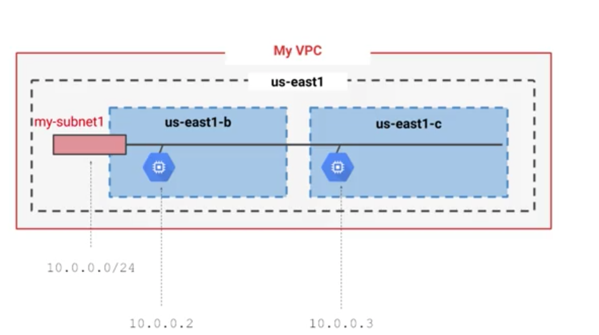

# [Coursera] Introducing Google Cloud Platform

## Zones
> Multi-Region > Region > Zone
- deployment area for GCP resources, single failure domain within a region
- Single failure domain within a region  
- All the zones within a region have fast network connectivity among them.
ex) A fault tolerant application: you can spread their resources across multiple zones in a region

> Multi-Region의 경우 미국 동부, 서부 등 미국을 묶어놓은 것이지 유럽과 미국을 묶어놓는 개념은 아님

## Billing
- billing by the second
> 이게 왜 혁신인 것인가?

## Project
- track resource and quota usage, billing, permission & credentials, enable services and APIs
- One orgaization node. Or no organization node no folder.
> 팀 구조에 맞게 folder를 사용해서 만들고 권한을 부여해서 사용하며 org node, folders, projects, resources 레벨 어느 곳에서나 권한을 부여할 수 있도록 되어있음. folder가 project위에 있는 이유는 project 상위 레벨에 있어야 한 팀이 여러 프로젝트에 대한 권한을 가질 수 있는 구조이지 않을까?

> Tip! The more generous policy is the one that takes effect!

## IAM
- Primitive roles:
- Predefined roles:  

## Security
- Google takes care of the lower parts of the stack, not all aspects, and customers are responsible for the higher parts.

## VPC
- VPC networks are global
- Subnets are regional

> Tip! 다른 zone에 노드를 구성하고 같은 region내 서브넷으로 을 구성하여주면 resilient 하면서도 간단한 네트워크 레이아웃으로 구성할 수 있다  
> Tip! You can dynamically increase the size of a subnet in a custom network by expanding the range of IP addresses allocated to it. Doing that doesn’t affect already configured VMs.  
- Built in routing tables are used to forward traffic from one instance to another instance within the same network 
> You don't have to provision or manage router
- Firewall rules using metadata tag ex) 80, 443 port is allow - `web` tag
- `VPC peering` - 여러 GCP project가 있고 VPC끼리 통신해야할 때

## VPC Load Balancing option
- Global HTTP(S): Layer 7 load balancing based on load
- Global SSL Proxy: Layer 4 load balancing of non-HTTPS SSL traffic based on load
- Global TCP Proxy: Layer 4 load balancing of non-SSL TCP traffic
- Regional: any traffic (TCP, UDP)
- Regional internal: traffic inside a VPC
> HTTP-based traffic across multiple Compute Engine regions 도 가능하고 business logic layer 와 presentation layer간 통신이 필요한 경우는 internal load balancing을 사용

## Cloud DNS
- Highly available and scalable
- `8.8.8.8` provides a public domain name service to the world

## Interconnect Options
- VPN: multi-Gbps connection over VPN teunnels 
> 내부 네트워크와 GCP 네트워크를 연결할 때 사용
- Direct Peering
- Carrier peering
- Dedicated Interconnect: SLA available

## Big VM vs many VMs
- Big VMs for in-memory databases and CPU-intensive analytics
- Many VMs for fault tolerance and elasticity

## Kubernetes
- `POD`: A group of containers that work together

## Lab - GCP Fundamentals: Getting Started with Cloud Marketplace
- Compute Engine instance(VM)에 LAMP 배포
> market place가 메뉴의 제일 위에 있음! 비용은 사용한 만큼 + (라이센스 비)

## Lab - GCP Fundamentals: Getting Started with Compute Engine
- 두개 vm을 같은 region 다른 zone에 만들어서 my-vm-1에만 http 허용한다음 my-vm-2에서 ssh로 my-vm-1으로 접속해서 NGINX를 설치하는 예제
- 같은 region 에 있으면 아무 작업을 하지 않아도 ping은 가능한데 hostname에 project가 붙음. `my-vm-1`이면 `my-vm-1.c.qwiklabs-gcp-c12eb6551e9c9af6.internal`으로 GCP가 internal IP에 대해 DNS resolution을 제공하기 떄문
~~~bash
google3628695_student@my-vm-2:~$ ping my-vm-1
PING my-vm-1.c.qwiklabs-gcp-c12eb6551e9c9af6.internal (10.128.0.2) 56(84) bytes of data.
64 bytes from my-vm-1.c.qwiklabs-gcp-c12eb6551e9c9af6.internal (10.128.0.2): icmp_seq=1 ttl=64 time=2.23 ms
64 bytes from my-vm-1.c.qwiklabs-gcp-c12eb6551e9c9af6.internal (10.128.0.2): icmp_seq=2 ttl=64 time=0.819 ms
64 bytes from my-vm-1.c.qwiklabs-gcp-c12eb6551e9c9af6.internal (10.128.0.2): icmp_seq=3 ttl=64 time=0.835 ms
~~~
- 하나는 cloud console에서 하나는 command를 사용하여 생성

## Discussion
- zone이 데이터 센터와 비슷한 개념이기는 하지만 물리적으로 1 zone에 1 building만 있으라는 보장은 없음. 그보다는 `fault tolerence`의 관점에서 zone은 region 내에서 sigle failure domain으로 바라봐야 함
- 그리고 동일한 region내에서 여러 zone을 선택하는 이유는 region 내의 zone 끼리는 round trip network latencies는 5 millisec으로  빠른 네트워크로 구성
- `checkpointed` & `restarted`가능한 배치 작업은 preemtable VM을 사용하면 비용을 절약할 수 있다고 하는데 체크포인팅을 너무 길게 잡거나 작업 중 중단 됨으로 인한 재처리로 실질적으로 리소스 사용 시간이 더 길어지면 비용을 더 내야하는 경우도 있지 않나?
