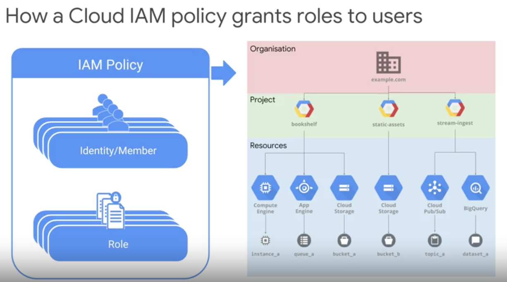
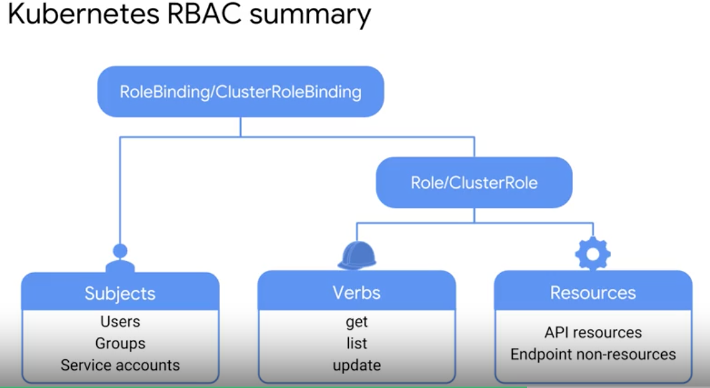

# [Coursera] Architecting with Google Kubernetes Engine: Production

# Logging
- container logs 
~~~bash
$ kubectl logs [POD_NAME] # viewing container logs
$ kubectl logs --tail=20 [POD_NAME] # most recent 20 lines
$ kubectl logs --since=3h [POD_NAME] # most recent 3 hours
~~~
- json format log
- As these log files grow, the node this can easily become saturated. 
- GKE streams these logs to Stackdriver by default, and then regularly runs the Linux `log rotate utility` to clean up these files. 
> kubectl 커맨드로 최신의 로그를 확인할 수는 있지만 용량 때문에 stack driver에 스트림으로 밀어넣고 파일을 삭제하여 서버 용량을 확보하려 함 
> stack driver의 경우 월 50기가 까지 무료이고 default setting은 30 days
> You may be wondering whether for a real-world application those messages are useful. It's an increasingly common practice for applications to simply write log messages to standard output with no buffering or filtering.

## Monitoring
- SRE: Google's approach to DevOps and it's a fundamental part of how Google runs its services reliably and at massive scale.
- Service Hierarchy: Monitoring -> Incident Response -> Postmoterm/Root Cause Analysis -> Testing and Release Procedures -> Capacity Planning -> Development -> Product
- Monitoring is the most fundamental layer of the service reliability hierarchy.
> 피라미드로 위에 있는 액티비티들은 하위 액티비티와 의존하고 있다고 보면 됨. Product는 개발에 의존하고 있고 개발은 용량 산정 계획에 의존. 모니터링이 Service Reliability를 실현하는데 가장 기초적인 부분
- number of nodes
- node utilization
- Pods/deployment running
- errors and failures
- Monitoring the pods: application metrics, container metrics, system metrics
> Tip! IP address보다는 label을 잘 지정해놓으면 모니터링하기가 수월

## Probes
- Microservice: How do you know the shopping cart is functioning properly?
> order - shopping cart - dredit card processing ..
- `Liveness Probes`: Not running, restart the container
- Command probe handler
~~~yaml
apiVersion: v1
kind: Pod
metadata: 
  name: demo-pod
  namespace: default
spec:
  containers:
  - name: liveness
    livenessProe:
      exec:
        command:
        - cat
        - /tmp/ready
~~~
- HTTP probe handler
~~~yaml
spec:
  containers:
  - name: liveness
    livenessProbe:
      httpGet:
        path: /healthz
        port: 8080
~~~
- TCP probe handler
~~~yaml
spec:
  containers:
  - name: liveness
    livenessProbe:
      tcpSocket:
        port: 8080
~~~
- Readiness Probes: Ready to accept requests? If not, remove the Pod's IP address from all service endpoint
~~~yaml
spec:
  containers:
  - name: liveness
    livenessProbe:
      tcpSocket:
        port: 8080
      initialDelaySeconds: 15
      periodSecond: 10
      timeoutSeconds: 1
      successThreshold: 1
      failureThreshold: 3
~~~
> Kubelet은 liveness 기반으로 컨테이너를 재시작하는데  Readiness는 서비스에서 Pod를 제거해버리는 방법으로 서비스를 정상화 하려고 함

## Cloud IAM
- Who? (Member/Identity): example@gmail.com
- Which? My Project
- What? roles/compute.viewer 
- IAM policies can be `attathced` to Organization, Folder, Project, Resources
- Google Cloud Directory Sync(`GCDS`) to sync LDAP or Active directory
- The effective IAM permissions on any member are the `union` of the permissions granted at all levels of the resource hierarchy.
> Organization > Project > Resources
- Grant very `few` permissions at `higher levels`, and additional permissions must be granted to only those who need them. 
> 주의! 상위 레벨이서 부여한 권한을 하위 레벨에서 뺄 수는 없음
> It is possible to grant an IAM permission at a higher point in the GCP resource hierarchy and revoke it at a lower point. (false)

## Kubernetes RBAC (Role Based Access Control)
- Role/Cluster Role

- example 1: Basic role
~~~yaml
apiVersion: rbac.authorization.k8s.io/v1
kind: Role
metadata:
  namespace: default
  name: demo-role
rules:
  - apiGroups: [""]
  - resources: ["pods"]
  - verbs: ["get", "list", "watch"]
~~~
- example 2: add pod/log with standard read only verbs
~~~yaml
rules:
  - apiGroups: [""]
  - resources: ["pods", "pod/logs"]
  - verbs: ["get", "list", "watch"]
~~~
- example 3
~~~yaml
rules:
  - apiGroups: [""]
  - resources: ["pods"]
  - resourceNames: ["demo-pod"]
  - verbs: ["patch", "update"]
~~~
- example 4
~~~yaml
- nonResourceURLs: ["metrics/", "metrics/*"]
- verbs: ["get","post"]
~~~
> 이전 버전에서는 ABAC(Attribute base access control)을 사용하였으나 이제는 지원하지 않음. RBAC가 더 사용하기 편하다고 함
> IAM이 있는데 RBAC을 또 쓰는 이유?

## Lab: Securing GKE with Cloud IAM and Pod Security Policies
> Task 1. 계정 2개를 사용. 두번째 계정으로 쿠버네티스 클러스터를 만들 때 발생하는 권한 오류를 해결하기 위해 첫번 째 계정으로 로그인하여 IAM & Admin에서 권한을 줌
- `create a cluster` is disabled 
> IAM & admin > IAM에서 Kubernetes Engine > Kubernetes Engine Admin 
- Click Compute Engine default service account to selet it
- Open permissions info panel 
- Assign iam.serviceAccountUser role 

> Task2. Create and Use Pod Security Policies
~~~yaml
apiVersion: policy/v1beta1
kind: PodSecurityPolicy
metadata:
  name: restricted-psp
spec:
  privileged: false  # Don't allow privileged pods!
  seLinux:
    rule: RunAsAny
  supplementalGroups:
    rule: RunAsAny
  runAsUser:
    rule: MustRunAsNonRoot
  fsGroup:
    rule: RunAsAny
  volumes:
  - '*'
~~~
~~~yaml
apiVersion: rbac.authorization.k8s.io/v1
kind: RoleBinding
metadata:
  name: restricted-pod-rolebinding
  namespace: default
roleRef:
  apiGroup: rbac.authorization.k8s.io
  kind: ClusterRole
  name: restricted-pods-role
subjects:
# Example: All service accounts in default namespace
- apiGroup: rbac.authorization.k8s.io
  kind: Group
  name: system:serviceaccounts
~~~

## Lab Implementing Role-Based Access Control With Kubernetes Engine
~~~yaml
apiVersion: v1
kind: Namespace
metadata:
  name: production 
~~~               
~~~bash
$ kubectl create -f ./my-namespace.yaml
$ kubectl get namespaces
$ kubectl describe namespaces production
$ kubectl apply -f ./my-pod.yaml --namespace=production
~~~

- kubectl apply -f pod-reader-role.yaml
- kubectl get roles --namespace production
