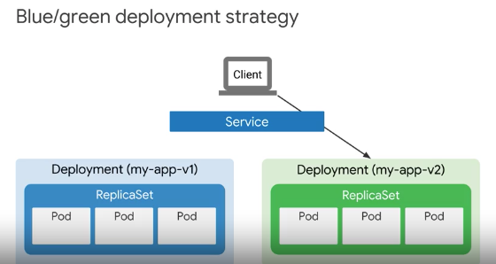

# [Coursera] Architecting with Google Kubernetes Engine: Workloads

## The kubectl command
> kubectl 커맨드가 처리되는 과정
- `kubectl`은 command를 API call로 변경 
- `master`의 `kube-apiserver`가 API call을 받고 `etcd`를 질의하여 요청을 처리
- kube-apiserver가 결과를 https로 전달

- config
~~~bash
$ $HOME/.kube/config # target cluster name, credentials
$ kubectl config view
$ gcloud container clusters \
  get-credentials [CLUSTER_NAME] \
  --zone [ZONE_NAME]
~~~
> .kube/config가 설정된 이후에는 kubectl 커맨드가 credential을 묻지 않고 default cluster에 연결가능
- kubectl syntax
~~~bash
# kubectl [command] [type] [name] [flags]
$ kubectl get pods my-test-app -o=yaml
$ kubectl describe pod [POD_NAME]
$ kubectl exec [POD_NAME] ps aux
$ kubectl exec [POD_NAME] env
$ kubectl exec -it [POD_NAME] -- [command]
$ kubectl exec -it demo -- /bin/bash
~~~
command: get, describe, logs, exec ...
type: pod, deployents, nodes ...
name: object name
flags: -o=yaml, -o=wide ..
> TIP! -o=yaml 옵션은 kubernetes object를 다시 만들 때 유용

## Introspection
- The act of gathering information about containers, pods, services, and other engines running within the cluster
- Pod phases: pending, running, succeeded, failed, unknown
> What is most common reason for a Pod to report `CrashLoopBackOff` as its state? The Pod's configuration is not correct.

## Pod Networking
- VPC cloud range 내 1 Pod 1 IP addr (alias IP)
> Pod가 독립된 IP 주로를 가지기 때문에 Pod끼리 통신이 가능
`VPC`s are locally isolated networks that provides connectivity for resource you deploy with GCP, such as kubernetes cluster, compute engine instance, and App Engine Flex instances
> IP가 부족하지 않도록  클러스터 내 통용되는 IP로 4000개를 확보하고 Pod를 위한 IP range를 별개로 부여함. /14 로 부여하면 25만개 IP address인데 실제로는 하나의 클러스터에서 25만개 IP를 쓸 일이 거의 없다고 가정하여 한 노드에는 250개 정도의 IP만 사용하도록 제한하여 1000 노드를 쓸 수 있도록 함. 1000노드 100 Pod가 기본값

## Deployment
- New Pods are created or updated by your deployment
> pod를 여러개 만들 때 하나하나 만드는 것이 아니라 deployment를 만들어서 pod가 몇개가 있어야 하는지를 적어놓으면 deployment controller가 알아서 이상적인 상태를 유지해 줌
- Desired state of pods ex) make sure that five NGINX pods are running all times
- well suited for stateless application
- Deployment controller: responsible for keeping the desired state over time!
~~~bash
$ kubectl apply -f [DEPLOYMENT_FILE]
$ kubectl run [DEPLOYMENT_NAME] \
  --image [IMAGE]:[TAG] \
  --replicas 3 \
  --labels [KEY]=[VALUE] \
  --port 8080
  --generator deployment/apps.v1 \
  --save-config
~~~
> deployment를 만드는 법은 3가지가 있는데 yaml 파일 or 커맨드 라인 or 콘솔 
> 커맨드로 만들어 놓은 것을 -o yaml 옵션을 써서 파일로 받을 수도 있다.
~~~bash
$ kubectl get deployment [DEPLOYMENT_NAME] -o yaml > this.yaml
~~~
- scaling a deployment 
~~~
$ kubectl create deployment [DEPLOYMENT_NAME] -replicas=5

# Horizontal pod auto scaler
$ kubectl autoscale deployment [DEPLOYMENT_NAME] --min=5 --max=15 --cpu-percent=75
~~~
> 너무 자주 auto scaling 되는 경우를 방지하기 위해서 cooldown/delay 옵션이 지원되며 기본 값은 5분 `--horizontal-pod-autoscalaler-downscale-delay`

## Deployment strategy
- rolling update 

> rolling update에서는 max unavailable, max surge에 pod수나 percent로 기술할 수 있음
- blue-green udpate: switch all traffic 

> label selector가 pod를 선택할 때 label을 보고 선택. 배포 과정에서 리소스를 두 배로 사용해야하는 부담이 있음
- canary deployment: gradual test 

> 카나리 배포는 blue-green과 비슷하지만 resource를 shift. 일부를 배포해봐서 안정성이 검증되면 그 나머지를 배포

## Jobs
- example: pi 

> Job은 Deployment처럼 kubernetes object인데 배치 job에 적합. job실행 후 종료되거나, 실패했을 때 다른 pod로 옮겨서 처리하거나, 병렬/순차적으로 처리하는 부분이 고려됨
- non parallel
- parallel ex) parallel job with fixed completion count
~~~yaml
apiVersion: batch/v1
kind: Job
metadata:
  name: my-app-job
spec:
  completions: 3
  parallelism: 2
  backoffLimit: 4
  activeDeadlineSeconds: 300
  template:
    spec:
[...]
~~~

## CronJobs
~~~yaml
apiVersion: batch/v1
kind: CronJob
metadata:
  name: my-app-job
spec:
  schedule: "*/1 * * * *"
  concurrencyPolicy: Forbid # if existing job hasn't finished, Cron job won't excute a new job 
  jobtemplate:
    spec:
      ...
~~~
> 크론탭 처럼 쓸 수 있는 kubernetes object인데 다른 object하고 같이 쓸 수 있어야 하는 것이 아닌가?

## Service
- In ever-changing container amendments, services give pods a `stable IP address` and name that remains the same through updates, upgrades, scalability changes, and even pod failures
> Service가 Pod 앞에 있으면서 Pod에게 IP를 부여하고 트래픽을 전달하는데 Pod는 깨진 다음에 다시 생성될 때 새로운 IP를 가지기 때문에 Service쪽에 static IP를 부여. 
>Pod를 Service와 엮는 방법으로 `label selector` 사용

- Find services: Environment Variables, Kubernetes DNS add on for service discovery, Istio

## Service Types and Load Balencers
> 서비스 타입의 세 가지: cluster IP, node port, load balencer
> (단, cluster IP는 외부에서 접근 불가한 internal IP)

- `cluster IP`: static IP address for `internal` communications within a cluster
- `node port`: Enable external communication
- `load balencer`: Exposing services outside a cluster. Inbound access from outside the cluster into the service. To eliminate `double hop`, set `externalTrafficPolicy: Local`
~~~yaml
apiVersion: v1
kind: Service
metadata:
    name: my-service
spec:
    type: ClusterIP
    selector:
        app: Backend
    ports:
        - protocol: TCP
          port: 80
          targetPort: 9376
~~~
- double hop problem

> 더블 홉 딜레마: HTTP 로드 밸런서가 노드를 랜덤으로 선택하여 트래픽을 분산하고 노드가 kube proxy를 사용해서 Pod를 (공평하게) 선택하는 과정에서 선택한 Pod가 다른 노드에 있는 경우 트래픽을 보내고 응답을 받는 과정에서 트래픽이 낭비되는 현상. 이 현상을 방지하기 위한 옵션을 사용하거나 Container-native load balancer를 사용한다.
- container-native load balancer 

## Ingress resource
- To provide external access to one or more Services
- Collection of rules that direct external inbound connections to a set of services within the cluster (kind of a service for services)
- The traffic doesn't match any of these host-based or path-based rules, it simply send to the default backend.
> spec에 특정 host와 path가 어떤 service:port로 가야 하는지에 대한 rule을 기록
~~~bash
$ kubectl edit ingress [NAME]
$ kubectl replace -f [FILE]
~~~

## Volumes
- Durable storage outside a Pod

- Types: Long-lived (persistent disks), Short-lived (emptyDir는 pod가 지워질 때 같이 삭제), Networked (NFS)
- NFS volume을 pod가 생성될 때 /mnt/vol에 mount해주는 예제
~~~yaml
apiVersion: v1
kind: Pod
metadata:
  name: web
spec:
  containers:
  - name: web
    image: nginx
    volumeMounts:
    - mountPath: /mnt/vol
      name: nfs
  volumes:
  - names: nfs
    server: 10.1.1.2
    path: "/"
    readOnly: false
~~~
> State 공유가 필요한 상용 어플리케이션을 개발하고 있다면 Pod에 volume을 붙여서 Pod 내 container끼리 state를 공유할 수 있도록 만듬
- compute engine persistent disk
~~~bash
$ gcloud compute disks create --size=100GB --zone=us-central1-a demo-disk
~~~
~~~yaml
volumes:
 - name: pd-volume
   gcePersistentDisk:
     pdName: demo-disk
     fsType: ext4     
~~~

## Secret and ConfigMap
- ConfigMap: General-purpose configuration information to decouple configuration from Pods
- Secret: Manage sensitive information such as passwords, OAuth tokens, SSH keys

## Stateful Set

## Lab - Creating a GKE Cluster via Cloud Shell
~~~bash
$ export my_zone=us-central1-a
$ export my_cluster=standard-cluster-1
$ gcloud container clusters create $my_cluster --num-nodes 3 --zone $my_zone --enable-ip-alias
$ kubectl cluster-info
Kubernetes master is running at https://35.224.225.105
GLBCDefaultBackend is running at https://35.224.225.105/api/v1/namespaces/kube-system/services/default-http-backend:http/proxy
Heapster is running at https://35.224.225.105/api/v1/namespaces/kube-system/services/heapster/proxy
KubeDNS is running at https://35.224.225.105/api/v1/namespaces/kube-system/services/kube-dns:dns/proxy
Metrics-server is running at https://35.224.225.105/api/v1/namespaces/kube-system/services/https:metrics-server:/proxy

To further debug and diagnose cluster problems, use 'kubectl cluster-info dump'.
$ kubectl config get-contexts
                   NAMESPACE
*         gke_qwiklabs-gcp-fab7f79387782b8f_us-central1-a_standard-cluster-1   gke_qwiklabs-gcp-fab
7f79387782b8f_us-centr
$ kubectl top nodes
NAME                                                CPU(cores)   CPU%   MEMORY(bytes)   MEMORY%
gke-standard-cluster-1-default-pool-60988e96-5lbm   51m          5%     534Mi           20%
gke-standard-cluster-1-default-pool-60988e96-634p   44m          4%     570Mi           21%
gke-standard-cluster-1-default-pool-60988e96-qjkf   56m          5%     536Mi           20%
~~~

## Lab - Upgrading Kubernetes Engine Clusters
> 쿠버네티스 버전이 낮은 경우 Clusters > Details 메뉴의 master version 옆에 `upgrade avarilable` 메뉴가 떠서 클릭하면 업그레이드됨

## Lab - Creating Kubernetes Engine Deployments (*)
~~~
git clone https://github.com/GoogleCloudPlatformTraining/training-data-analyst
~~~
- nginx-deployment.yaml
~~~bash
apiVersion: apps/v1
kind: Deployment
metadata:
  name: nginx-deployment
  labels:
    app: nginx
spec:
  replicas: 3
  selector:
    matchLabels:
      app: nginx
  template:
    metadata:
      labels:
        app: nginx
    spec:
      containers:
      - name: nginx
        image: nginx:1.7.9
        ports:
        - containerPort: 80
~~~
~~~bash
$ kubectl apply -f ./nginx-deployment.yaml
~~~
- Scale: replica 늘리기
~~~bash
# Workloads > Deployment details > Actions > Scale
kubectl scale --replicas=3 deployment nginx-deployment
~~~
> 실습 화면을 좁게 사용하는 경우는 메뉴가 숨겨져있어서 바로 찾기 쉽지 않음
- deployment rollout and rollback
~~~
$ kubectl rollout status deployment.v1.apps/nginx-deployment
$ kubectl rollout undo deployments nginx-deployment
$ kubectl rollout history deployment nginx-deployment
~~~
- service : `ClusterIP`, `NodePort`, `LoadBalencer`
- service-nginx.yaml
~~~yaml
apiVersion: v1
kind: Service
metadata:
  name: nginx
spec:
  type: LoadBalancer
  selector:
    app: nginx
  ports:
  - protocol: TCP
    port: 60000
    targetPort: 80
~~~
~~~
$ kubectl apply -f ./service-nginx.yaml
$ kubectl get service nginx
~~~
- canary deployment
~~~yaml
apiVersion: apps/v1
kind: Deployment
metadata:
  name: nginx-canary
  labels:
    app: nginx
spec:
  replicas: 1
  selector:
    matchLabels:
      app: nginx
  template:
    metadata:
      labels:
        app: nginx
        track: canary
        Version: 1.9.1
    spec:
      containers:
      - name: nginx
        image: nginx:1.9.1
        ports:
        - containerPort: 80
~~~
~~~
$ kubectl apply -f nginx-canary.yaml
$ kubectl get deployments
$ kubectl scale --replicas=0 deployment nginx-deployment
$ kubectl get deployments
~~~

- sessionAffinity
> same request same pod
> 카나리 배포에서 다른 버전으로 교체될 때의 문제를 방지하기 위해서 `sessionAffinity: ClientIP` 옵션을 사용
~~~yaml
apiVersion: v1
kind: Service
metadata:
  name: nginx
spec:
  type: LoadBalancer
  sessionAffinity: ClientIP
  selector:
    app: nginx
  ports:
  - protocol: TCP
    port: 60000
    targetPort: 80
~~~

## Lab - Deploying Jobs on GKE
> 첫번째 예제는 pi의 소수점 이하 2,000까지 출력하는 예제 (구글이 좋아하는 예제)
> 두번째 예제는 crontab을 거는 예제
- `example-cronjob.yaml` 매 분마다 hello world를 출력하는 crone job
> `schedule` 부분을 보면 1분마다
~~~yaml
apiVersion: batch/v1beta1
kind: CronJob
metadata:
  name: hello
spec:
  schedule: "*/1 * * * *"
  jobTemplate:
    spec:
      template:
        spec:
          containers:
          - name: hello
            image: busybox
            args:
            - /bin/sh
            - -c
            - date; echo "Hello, World!"
          restartPolicy: OnFailure
~~~
- 배포 및 확인하는 법
> kubectl get jobs는 잘못된 명령어인듯 보임
~~~bash
$ kubectl get pods
$ kubectl logs [POD-NAME]
Thu Dec 20 15:31:16 WET 2018
Hello,World!
~~~

## Lab - Configuring Pod autoscaling
~~~
$ kubectl autoscale deployment web --max 4 --min 1 --cpu-percent 1
~~~
> 실습이 다소 길지만 핵심은 `kubectl autoscale deployment` deployment는 미리 만들어진 hello-app을 `gcr.io/google-samples/hello-app:1.0`을 사용

## Lab - Deploying Kubernetes Engine via Helm Charts
- Helm Chart installation
~~~bash
$ wget https://storage.googleapis.com/kubernetes-helm/helm-v2.6.2-linux-amd64.tar.gz
$ tar zxfv helm-v2.6.2-linux-amd64.tar.gz -C ~/
# Kubernetes service account: server side of Helm
$ kubectl create serviceaccount tiller --namespace kube-system
$ kubectl create clusterrolebinding tiller-admin-binding \
   --clusterrole=cluster-admin \
   --serviceaccount=kube-system:tiller
$ ~/helm init --service-account=tiller
$ ~/helm repo update
$ ~/helm install stable/redis
~~~
> Error: no available release name found 오류로 중단

## Lab - Deploying to Kubernetes Engine

## Lab - Configuring Google Kubernetes Engine
- Click the Availability, networking, security, and additional features => Enable VPC-native (using alias IP)
- Master IP Range, enter 172.16.0.0/28
> This step assumes that you don't have this range assigned to a subnet. Check VPC Networks in the GCP Console, and select a different range if necessary. Behind the scenes, GCP uses VPC peering to connect the VPC of the cluster master with your default VPC network.
- Inspect the cluster
~~~bash
$ gcloud container clusters describe private-cluster --region us-central1-a
~~~
- Enable master authorized networks (생략)
- Set egress policy (생략)
> 클러스터 이름과 pod수 외에도 상세 설정하는 부분에 대한 Lab

## Lab - Create Services and Ingreess
- dns demo: one service two pods
~~~bash
git clone https://github.com/GoogleCloudPlatformTraining/training-data-analyst
cd ~/training-data-analyst/courses/ak8s/10_Services/
kubectl apply -f dns-demo.yaml
kubectl get pods
kubectl describe pods dns-demo-2
echo $(kubectl get pod dns-demo-2 --template={{.status.podIP}})
ping dns-demo-2.dns-demo.default.svc.cluster.local # unknown
~~~
- ping test
~~~
apt-get update
apt-get install -y iputils-ping
kubectl exec -it dns-demo-1 /bin/bash
~~~
> pod가 ip를 가지지만 외부에서 ping이 되지 않고 1번 pod로 들어간 다음 ping을 설치하고 2번 pod로 ping 이 가는지 확인
그런데 ip를 직접 사용하지 않고 FQDNs를 사용하여 접근. 

- service
~~~yaml
apiVersion: v1
kind: Service
metadata:
  name: hello-lb-svc
spec:
  type: LoadBalancer
  selector:
    name: hello-v2
  ports:
  - protocol: TCP
    port: 80
    targetPort: 8080
~~~
- ingress
~~~yaml
apiVersion: extensions/v1beta1
kind: Ingress
metadata:
  name: hello-ingress
  annotations:
    nginx.ingress.kubernetes.io/rewrite-target: /
spec:
  rules:
  - http:
      Paths:
     - path: /v1
        backend:
          serviceName: hello-svc
          servicePort: 80
      - path: /v2
        backend:
          serviceName: hello-lb-svc
          servicePort: 80
~~~
~~~bash
$ kubectl apply -f hello-ingress.yaml
~~~

## Lab - Configuring Pod Autoscaling
> 로드를 부여하는 스크립트 load gen을 써서 오토 스케일링을 테스트
- HorizontalPodAutoscaler
~~~
$ kubectl get hpa
$ kubectl describe horizontalpodautoscaler web
~~~
~~~
apiVersion: apps/v1
kind: Deployment
metadata:
  name: loadgen
spec:
  replicas: 4
  selector:
    matchLabels:
      app: loadgen
  template:
    metadata:
      labels:
        app: loadgen
    spec:
      containers:
      - name: loadgen
        image: k8s.gcr.io/busybox
        args:
        - /bin/sh
        - -c
        - while true; do wget -q -O- http://web:8080; done
~~~

## Lab - Configuring Persistent Storage
- Persistent Volume Claim(PVC)
- pvc-demo.yaml
~~~yaml
apiVersion: v1
kind: PersistentVolumeClaim
metadata:
  name: hello-web-disk
spec:
  accessModes:
    - ReadWriteOnce
  resources:
    requests:
      storage: 30Gi
~~~
~~~bash
$ git clone https://github.com/GoogleCloudPlatformTraining/training-data-analyst
$ cd ~/training-data-analyst/courses/ak8s/12_Storage/
$ kubectl get persistentvolumeclaim
~~~
> PV(Persistent Volume) 오브젝트를 만들거나 Compute Engine persistent disks를 만들 수 있짐나 PVC를 만들면 쿠버네티스가 persistent volume을 만들어줌
- mount PVC to a Pod
~~~yaml
kind: Pod
apiVersion: v1
metadata:
  name: pvc-demo-pod
spec:
  containers:
    - name: frontend
      image: nginx
      volumeMounts:
      - mountPath: "/var/www/html"
        name: pvc-demo-volume
  volumes:
    - name: pvc-demo-volume
      persistentVolumeClaim:
        claimName: hello-web-disk
~~~
~~~bash
$ kubectl apply -f pod-volume-demo.yaml
$ kubectl exec -it pvc-demo-pod -- sh
$ kubectl delete pod pvc-demo-pod
$ kubectl get persistentvolumeclaim
~~~
> pod를 만들고 pod안에 들어가서 volume에 file을 만든 후에 pod를 delete
> pod를 다시 만들면 volume이 지워지지 않았기 때문에 똑같은 문자열이 실행되는 것을 알 수 있다.
- PVC를 `StatefulSet`에서 사용하는 방법 테스트
~~~bash
$ kubectl describe statefulset statefulset-demo
$ kubectl get pods
NAME                 READY   STATUS    RESTARTS   AGE
statefulset-demo-0   1/1     Running   0          13m
statefulset-demo-1   1/1     Running   0          12m
statefulset-demo-2   1/1     Running   0          12m
$ kubectl get pvc # replica 3개로 정의한 statefulset이 같은 volume을 공유하고 있음
NAME                                STATUS   VOLUME                                     CAPACITY   ACCESS MODES   STORAGECLASS   AGE
hello-web-disk                      Bound    pvc-36046b20-7f8d-11e9-a31a-42010a8000a4   30Gi       RWO            standard       16m
hello-web-disk-statefulset-demo-0   Bound    pvc-a71386a7-7f8d-11e9-a31a-42010a8000a4   30Gi       RWO            standard       13m
hello-web-disk-statefulset-demo-1   Bound    pvc-b40fb7cf-7f8d-11e9-a31a-42010a8000a4   30Gi       RWO            standard       13m
hello-web-disk-statefulset-demo-2   Bound    pvc-c015828d-7f8d-11e9-a31a-42010a8000a4   30Gi       RWO            standard       12m
$ kubectl describe pvc hello-web-disk-statefulset-demo-0
~~~
- statefulset-demo.yaml
~~~yaml
apiVersion: apps/v1
kind: StatefulSet
metadata:
  name: statefulset-demo
spec:
  selector:
    matchLabels:
      app: MyApp
  serviceName: statefulset-demo-service
  replicas: 3
  updateStrategy:
    type: RollingUpdate
  template:
    metadata:
      labels:
        app: MyApp
    spec:
      containers:
      - name: stateful-set-container
        image: nginx
        ports:
        - containerPort: 80
          name: http
        volumeMounts:
        - name: hello-web-disk
          mountPath: "/var/www/html"
  volumeClaimTemplates:
  - metadata:
      name: hello-web-disk
    spec:
      accessModes: [ "ReadWriteOnce" ]
      resources:
        requests:
          storage: 30Gi
~~~
~~~bash
$ kubectl get pods
NAME                 READY   STATUS              RESTARTS   AGE
statefulset-demo-0   0/1     ContainerCreating   0          1s
statefulset-demo-1   1/1     Running             0          18m
statefulset-demo-2   1/1     Running             0          18m
~~~
> 0번 pod로 들어가서 html 파일을 mount한 volumn에 쓴 뒤 pod 삭제 후 다시 get pods해보면 replica 3개를 유지하기 위해 새로 만들어지고 있고 (age로 확인) 새로 생긴 pod로 들어가서 확인해보면 아까 작성한 파일이 그대로 있음

## Lab - Working with GKE Secrets and ConfigMaps
- pub/sub topic 
~~~bash
$ export my_pubsub_topic=echo
$ export my_pubsub_subscription=echo-read
$ gcloud pubsub topics create $my_pubsub_topic
$ gcloud pubsub subscriptions create $my_pubsub_subscription \
 --topic=$my_pubsub_topic
~~~
- deployment
~~~bash
$ git clone https://github.com/GoogleCloudPlatformTraining/training-data-analyst
$ cd ~/training-data-analyst/courses/ak8s/13_Secrets/
$ kubectl apply -f pubsub.yaml
~~~
- pubsub.yaml
~~~yaml
apiVersion: apps/v1
kind: Deployment
metadata:
  name: pubsub
spec:
  selector:
    matchLabels:
      app: pubsub
  template:
    metadata:
      labels:
        app: pubsub
    spec:
      containers:
      - name: subscriber
        image: gcr.io/google-samples/pubsub-sample:v1
~~~
> Pub/Sub에 topic을 만들고 topic으로부터 읽어가는 application을 만드는 예제. 미리 만들어진 appilcation이 gcr.io에 들어있는데 credential이 없이 배포하면 오류가 난다. 
~~~bash
$ kubectl apply -f pubsub.yaml
error: unable to recognize "pubsub.yaml": Get http://localhost:8080/api?timeout=32s: dial tcp 127.0.0.1:8080: connect: connection refused

$ kubectl logs -l app=pubsub
The connection to the server localhost:8080 was refused - did you specify the right host or port?
~~~
- Create service account credentials
> IAM에서 pub/sub 권한을 부여한 key를 만들어서 json file로 받은 다음 cloud shell로 파일을 올려서 secret을 생성해 준 후 json file은 삭제
~~~bash
$ kubectl create secret generic pubsub-key --from-file=key.json=$HOME/credentials.json
$ rm -rf ~/credentials.json
 ~~~

## Notes
kubectl get nodes -o=yaml
kubectl get pods
kubectl describe pod
> get pods하고 describe pod의 차이
kubectl get nodes
kubectl get logs
kubectl get pods -o=wird
kubectl exec -it -- /bin/bash
backofflimit
